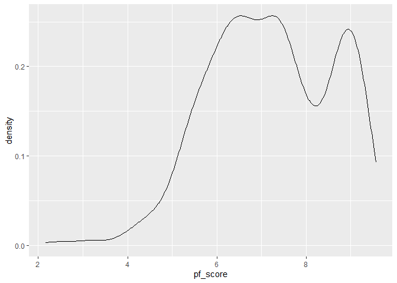
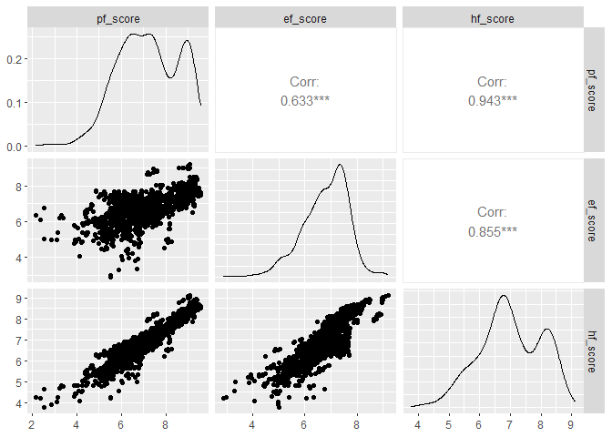

Fitting a Multiple Linear Regression Model
================

``` r
hfi <- read_csv("https://www.openintro.org/data/csv/hfi.csv")
```

    ## Rows: 1458 Columns: 123
    ## -- Column specification --------------------------------------------------------
    ## Delimiter: ","
    ## chr   (3): ISO_code, countries, region
    ## dbl (120): year, pf_rol_procedural, pf_rol_civil, pf_rol_criminal, pf_rol, p...
    ## 
    ## i Use `spec()` to retrieve the full column specification for this data.
    ## i Specify the column types or set `show_col_types = FALSE` to quiet this message.

Plottig a density graph to display the distribution of pfi_score

``` r
ggplot(hfi, aes(x = pf_score)) +
  geom_density()
```

    ## Warning: Removed 80 rows containing non-finite values (`stat_density()`).

<!-- -->

The density graph is negatively skewed. It also has 3 peak. The
distribution appears to be biomodal with the main peak around 6.5 and
another significant peak around 8.9.

## Pairwise Relationships

``` r
hfi %>%
  select(ends_with("_score")) %>%
  ggpairs()
```

<!-- -->

From this visualization, all variables have linear patterns. Pf_score
has a bimodal distribution with 3 peaks and is negatively skewed,
ef_score is negatively skewed and appears to have a normal distribution,
while hf_score has a bimodal distribution which is also negatively
skewed.

## The Multiple Linear Regression Model

``` r
m_hr_ef <- lm(pf_score ~ hf_score + ef_score, data = hfi)
tidy(m_hr_ef)
```

    ## # A tibble: 3 x 5
    ##   term         estimate std.error statistic p.value
    ##   <chr>           <dbl>     <dbl>     <dbl>   <dbl>
    ## 1 (Intercept)  1.46e-11  1.50e-10  9.78e- 2   0.922
    ## 2 hf_score     2.00e+ 0  3.63e-11  5.52e+10   0    
    ## 3 ef_score    -1.00e+ 0  4.21e-11 -2.38e+10   0

The estimated equation is y = 1.46 + 2.00(hf_score) - 1.00(ef_score).

For countries with ef_score and hf_score of 0, we expect their mean
pf_score to be 1.46.

For every 1 unit increase in ef_score we expect the pf_score to decrease
by 1 unit.

For every 1 unit increase in hf_score we expect the pf_score to increse
by 2 units.

\##3D Plots

``` r
library(plotly)
```

    ## 
    ## Attaching package: 'plotly'

    ## The following object is masked from 'package:ggplot2':
    ## 
    ##     last_plot

    ## The following object is masked from 'package:stats':
    ## 
    ##     filter

    ## The following object is masked from 'package:graphics':
    ## 
    ##     layout

``` r
plot1 <- plot_ly(
  hfi, x = ~hf_score , y = ~ef_score, z = ~pf_score, sizes = c(0.5,0.5,0.5)
)
```
